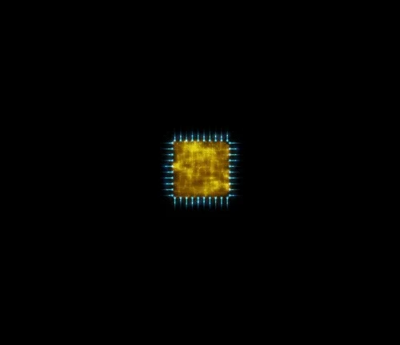

  

# Hi there! I'm Wagner Santos

# ⚙ Backend developer 
◽ 💪 Working with .NET, C#, SQL 

◽  📚 Currently learning .NET, C#, Rest API, SQL and JavaScript

# Hobbies
◽ 🚴‍♂️ Cycling  
◽ 🏋️‍♂️ Gym  
◽ 🎉 Spending time with family and friends  
◽ ⚽ Soccer  
◽ 🎶 Music  
◽ 🚀 Traveling  

 <h1 align="center">🏆Profile</h1>

Loves learning about news tecnologies and creating websites and commercial systems. 

  

  
  <h1 align="center">📬Contact</h1>

  

<h1 align="center">🤓 Skills - Hard Skills</h1>

 
 
 
 
 
 

---

 

---

# 

